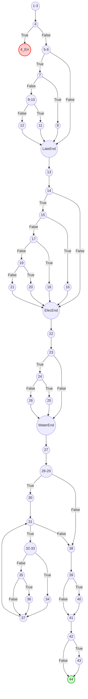

# Đồ Thị Dòng Điều Khiển Tối Giản (Circle CFG)

```mermaid
graph TD
    %% Định nghĩa các Node dạng hình tròn () và chỉ để số
    N1_3((1-3))
    N4((4))
    N4_Err((4_Err))
    N5_6((5-6))
    N7((7))
    N8((8))
    N9_10((9-10))
    N11((11))
    N12((12))
    N_LateEnd((LateEnd))
    N13((13))
    N14((14))
    N15((15))
    N16((16))
    N17((17))
    N18((18))
    N19((19))
    N20((20))
    N21((21))
    N_ElecEnd((ElecEnd))
    N22((22))
    N23((23))
    N24((24))
    N25((25))
    N26((26))
    N_WaterEnd((WaterEnd))
    N27((27))
    N28_29((28-29))
    N30((30))
    N31((31))
    N32_33((32-33))
    N34((34))
    N35((35))
    N36((36))
    N37((37))
    N38((38))
    N39((39))
    N40((40))
    N41((41))
    N42((42))
    N43((43))
    N44((44))

    %% Luồng đi của đồ thị
    N1_3 --> N4
    N4 -- True --> N4_Err
    N4 -- False --> N5_6

    %% Nhánh Phạt
    N5_6 -- True --> N7
    N5_6 -- False --> N_LateEnd
    N7 -- True --> N8 --> N_LateEnd
    N7 -- False --> N9_10
    N9_10 -- True --> N11 --> N_LateEnd
    N9_10 -- False --> N12 --> N_LateEnd

    %% Nhánh Điện
    N_LateEnd --> N13 --> N14
    N14 -- False --> N_ElecEnd
    N14 -- True --> N15
    N15 -- True --> N16 --> N_ElecEnd
    N15 -- False --> N17
    N17 -- True --> N18 --> N_ElecEnd
    N17 -- False --> N19
    N19 -- True --> N20 --> N_ElecEnd
    N19 -- False --> N21 --> N_ElecEnd

    %% Nhánh Nước
    N_ElecEnd --> N22 --> N23
    N23 -- False --> N_WaterEnd
    N23 -- True --> N24
    N24 -- True --> N25 --> N_WaterEnd
    N24 -- False --> N26 --> N_WaterEnd

    %% Nhánh Vòng lặp Dịch vụ
    N_WaterEnd --> N27 --> N28_29
    N28_29 -- False --> N38
    N28_29 -- True --> N30 --> N31
    N31 -- True --> N32_33
    N31 -- False --> N38

    N32_33 -- True --> N34 --> N37
    N32_33 -- False --> N35
    N35 -- True --> N36 --> N37
    N35 -- False --> N37
    N37 --> N31

    %% Nhánh Xe & Giảm giá
    N38 --> N39
    N39 -- True --> N40 --> N41
    N39 -- False --> N41
    N41 --> N42
    N42 -- True --> N43 --> N44
    N42 -- False --> N44

    %% Phong cách màu sắc quý phái
    style N4_Err fill:#ffcccc,stroke:#ff0000,stroke-width:2px;
    style N44 fill:#ccffcc,stroke:#00aa00,stroke-width:2px;
```
